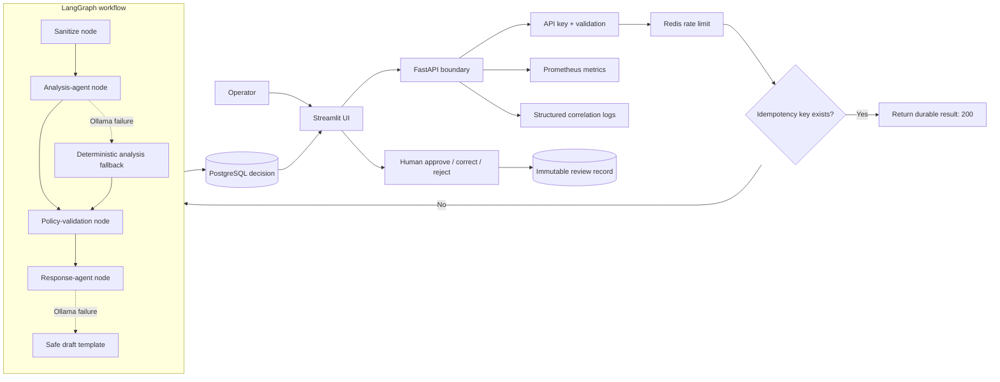
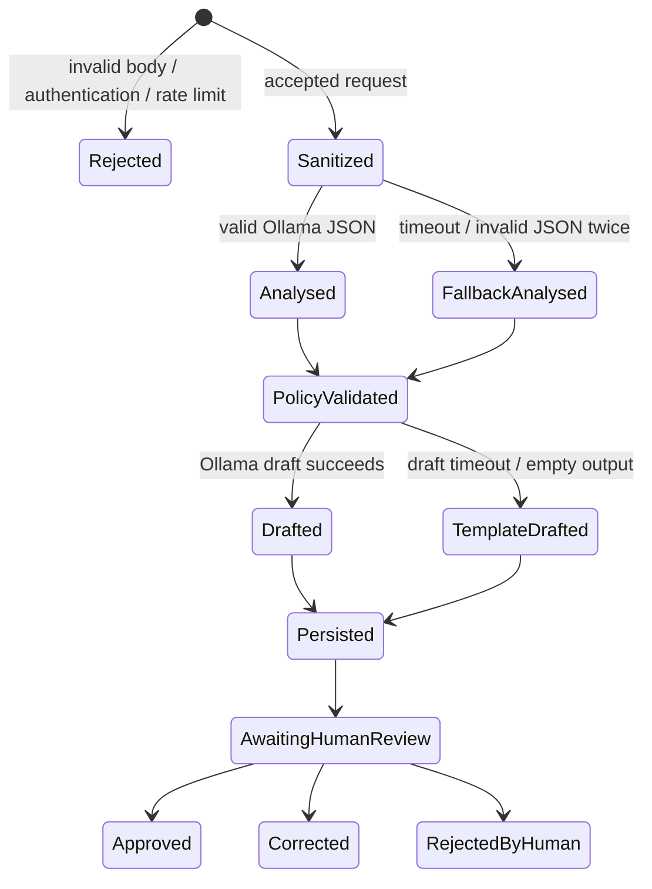

# Architecture and Agent-State Design

## System flow

## What the LangGraph state contains

`TriageState` is the typed contract shared by nodes. `original_text` is retained for the audit record;
`redacted_text` is the only form passed to Ollama. `decision` contains the validated structured output,
and `draft` contains the response-agent output. `warnings` and `trace` use additive reducers, so each node
appends evidence rather than overwriting earlier observations. `decision_source` exposes whether Ollama or
the deterministic fallback produced the classification.

| State field | Written by | Used by | Purpose |
|---|---|---|---|
| `original_text` | service entry | persistence | faithful audit input |
| `redacted_text` | sanitize | both AI agents and rules | prevent identifier leakage |
| `decision` | analyse, then validate | draft and response | schema-safe routing |
| `decision_source` | analyse | metrics and response | degradation visibility |
| `warnings` | all failure/security stages | UI and storage | actionable operator context |
| `trace` | every node | UI and storage | explain path and timing |
| `draft` | response agent/fallback | UI and storage | review-only acknowledgement |

## Why these four nodes

1. **Sanitize** is independent of model quality. Redaction and injection detection execute before any
   untrusted content reaches inference. Detected pure injection is normalised by policy and receives a
   guarded clarification template rather than being treated as a customer instruction.
2. **Analyse** is a judgment task: summarisation and multi-class routing benefit from a local LLM instead
   of an ever-growing keyword classifier. A JSON schema prevents free-form values.
3. **Validate** handles non-negotiable business invariants. Prompting alone cannot guarantee that a privacy
   exposure or outage will never be under-prioritised.
4. **Draft** is separated from analysis so customer-facing tone cannot modify the routing decision. It uses
   the already validated owner and priority.

Persistence is outside the graph because it is the transaction boundary for the final result. This avoids
partially saved intermediate model guesses. Authentication and rate limiting are outside because they are
HTTP concerns, not agent reasoning.

## Why LangGraph rather than LangChain or another agent framework

LangChain is useful for model, prompt, tool, and retrieval composition, but this challenge needs explicit
state transitions, independently testable nodes, accumulated trace state, and future conditional branches.
LangGraph exposes those control-flow semantics directly while still using the broader LangChain ecosystem.

An open-ended ReAct agent was rejected because the workflow has a known safe order and no dynamic external
tool catalogue. Allowing a model to choose arbitrary next steps would make latency, testing, and incident
policy enforcement less predictable. CrewAI or AutoGen would add multi-agent messaging for a task that has
two ordered roles, not autonomous collaborating teams. A plain Python function chain would be adequate for
the current four steps, but would make future approval interrupts, conditional specialist branches, or
parallel enrichment less visible. LangGraph provides that extension path without hiding control flow.

This is intentionally not a RAG system. There is no policy corpus to retrieve from, so LangChain retrieval
and a vector database would be architecture without a requirement. If policies are later supplied, a
retrieval node can be inserted before analysis and its citations carried in state.

## Failure-state flow

The system returns a useful result when local generation fails, but it does not silently hide degradation:
the decision source, warning, and trace are persisted and displayed.
